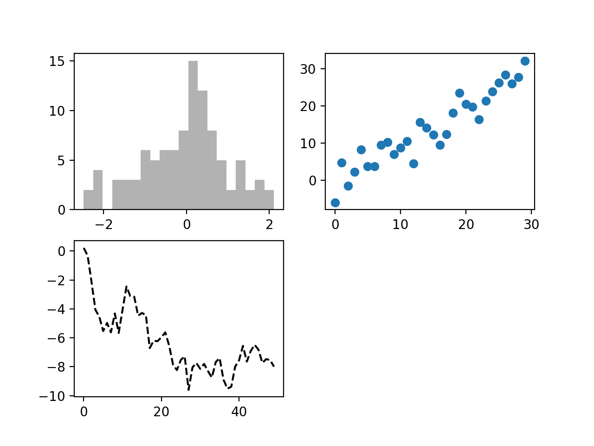

## 安装 python 依赖

```
pip3 install matplotlib

```

## 新建 app.py

```

# coding: utf-8

import matplotlib.pyplot as plt
import numpy as np

figure2 = plt.figure()

ax1 = figure2.add_subplot(2, 2, 1)
ax2 = figure2.add_subplot(2, 2, 2)
ax3 = figure2.add_subplot(2, 2, 3)


from numpy.random import randn

# 因为最后一个图是第三个，所以这个绘图会在最后一个（也就是第三个图）绘制散点图
plt.plot(randn(50).cumsum(), 'k--')

# 也可以对指定的图进行绘制
ax1.hist(randn(100), bins=20, color='k', alpha=0.3)
ax2.scatter(np.arange(30), np.arange(30) + 3 * randn(30))

plt.show()

```

## 运行

```
pip3 install app.py


```

效果



